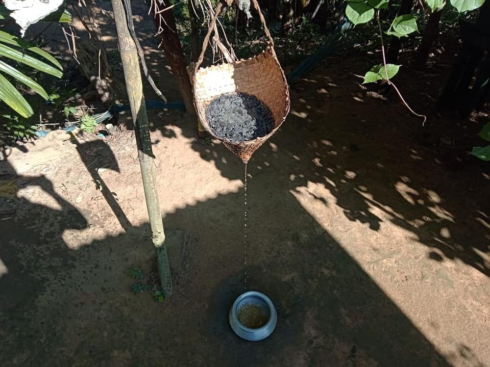

# Traditional Cuisines of Tripura

This document highlights some of the traditional dishes from Tripura, their ingredients, and preparation methods and often emphasize natural, oil-free, and masala-free cooking techniques.

---

## 1. Mui Borok  (*traditional dish*)
**Ingredients:**  
- Fermented fish (required)  
- Bamboo shoots / green vegetables / root vegetables / any other vegetable actually.  
- Green chilies  
- Garlic  
- Ginger  
- Coriander leaves  

**Comment:**  
Mui Borok is a broad term representing most cuisines local to the Borok (Tripuri community). It is usually prepared without using oil or masalas. Dishes like [Gudok](#5-gudok), [Muiya Awandru](#8-muiya-awandru), and [Berma Bwtwi](#11-berma-bwtwi-fermented-fish-soup) can all be categorized under Mui Borok, making it more of a category than a single dish.  

---

## 2. Chakhwi  (*traditional dish*)
**Ingredients:**  
- Soda (main ingredient; traditionally extracted from ash using a  *chekhok* or *Chakhwi Khok*)  
- Bamboo shoots  
- Green chilies  
- Ginger  
- Garlic  
- Salt  
- Lemon leaves (optional)  
- Pork (optional)  
- Banana trunk (optional)  

**Traditional Method of Extracting Alkaline Liquid:**  
In the olden days, the alkaline liquid was extracted from ash using a conical bamboo basket called *Chekhok* (or *Chakwi Khok*). The ash was placed inside the basket, water was added, and the liquid extract was collected at the bottom. This method has now been replaced by soda in most cases.  

---

## 3. Mosodeng Serma (Fried Chutney; Not Too Mainstream) (**Not Edited**)  
**Ingredients:**  
- Tomato  
- Green chilies  
- Garlic  
- Ginger  
- Salt  

---

## 4. Bhangui or Awang Bhangui  (*traditional dish*)
**Ingredients:**  
- Sticky rice  
- Ginger  
- Salt  
- Mustard oil
  

**Removed ingredients not used**  
**Lairu leaves required, in which the ingredients are wrapped in a conical shape and boiled**

---

## 5. Gudok  (*traditional dish*)
**Ingredients:**  
- Fermented fish (required)  
- Bamboo shoots (optional)  
- Green chilies (required)  
- Garlic  
- Ginger  
- Salt (required)  
- Onion (required)  
- Yardlong bean (optional, often used)  
- Turkey berry (often used)  
- Turmeric stem (optional)  
- Potatoes (optional)  

---

## 6. Wahan Mosdeng  (*traditional dish*)
**Ingredients:**  
- Pork  
- Green chilies  
- Onions  
- Garlic  
- Ginger  
- Coriander leaves  
- Salt  

---

## 7. Berma Bata (dish of the bengali community) (**Not Edited**)  
**Ingredients:**  
- Fermented fish (Berma)  
- Onions  
- Green chilies  
- Garlic  
- Mustard oil  
- Salt  

---

## 8. Muiya Awandru  (*traditional dish*)
**Ingredients:**  
- Awan (rice flour; prepared by soaking around one cup of rice in water, (depending on the amount of the whole dish), grinding it into a powder, and making it into a paste). This is the main ingredient.
- Bamboo shoots (main ingredient)  
- Ginger  
- Garlic  
- Green chilies  
- Salt
- lemon leaves (recommended)
- jackfruit seeds(recommended)

**Note:**  
No meat or oil is used in this dish, as chicken and pork have been removed from its traditional recipe.

---

## 9. Rice Roti  (dish of the bengali community) (**Not Edited**)  
**Ingredients:**  
- Rice flour  
- Water  
- Salt  
- Ghee  

---

## 10. Paanch Phoron Tarkari (dish of the bengali community) (**Not Edited**)  
**Ingredients:**  
- Mixed vegetables (potatoes, beans, brinjal)  
- Panch phoron (five-spice mix)  
- Mustard oil  
- Green chilies  
- Turmeric  
- Ginger  
- Salt  

---

## 11. Berma Bwtwi (Fermented Fish Soup)  (*traditional dish*)
**Ingredients:**  
- Fermented fish  
- Onion  
- Chili  
- Salt  
- Water  
